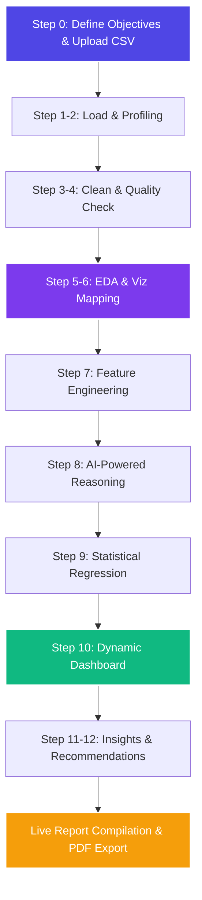

# 🤖 Data Analyst Agent
> **An Interactive Business Insights & Automated Data Analysis Pipeline**

[](https://developer.mozilla.org/en-US/docs/Web/JavaScript)
[](https://developer.mozilla.org/en-US/docs/Web/CSS)
[](https://www.chartjs.org/)
[](https://www.papaparse.com/)
[](https://ai.google.dev/)

Data Analyst Agent is a premium, client-side web application designed to orchestrate a complete **12-step data cleaning, exploratory analysis (EDA), feature engineering, modeling, and reporting workflow** on raw tabular datasets. Aligned with modern design systems, the application utilizes vibrant gradients, smooth micro-animations, glassmorphism card layouts, and responsive panels to deliver a visual and interactive data analysis experience.

---

## 🗺️ Architectural Workflow

The application operates as a linear dashboard stepper, processing uploaded data through subsequent validation layers:



---

## ✨ Key Features & Capabilities

- **📁 Interactive File Ingestion:** Supports drag-and-drop or browsing for standard CSV datasets. Detects column types (Numeric, Categorical, Date, Text) based on samples.
- **🧹 Automated Data Cleaning:** Checks and handles duplicate rows, corrects numerical formatting (stripping currency symbols and percent signs), and flags outliers using IQR (Interquartile Range).
- **🛡️ Quality Score Diagnostics:** Audits datasets against logical business constraints (such as non-negative prices or sales metrics) and assigns a letter grade (`A` to `D`) and numerical health score.
- **📊 Exploratory Data Analysis (EDA):** Dynamically computes a Pearson Correlation Coefficient Matrix and displays categorical value distributions.
- **🎨 Premium Visualizations:** Employs [Chart.js](https://www.chartjs.org/) to draw bar charts, line graphs, scatter plots, and doughnut charts matching an elegant indigo/violet design language.
- **⚙️ Feature Engineering:** Generates derived variables, extracts calendar features (Year, Month, Day of the week, Season), calculates ROI multiples, binned continuous metrics, and log transforms variables to linearize regression variance.
- **📈 Regression Modeling:** Computes ordinary least squares regression (slope, intercept, and correlation coefficient $r$) on the strongest correlated variable pair.
- **🧠 Hybrid AI Mode (Optional):** Integrating your **Gemini API Key** unlocks contextual interpretations, answering custom business questions and tailoring strategic suggestions.
- **🖨️ Document Compilation & Export:** Compile your progress automatically into the side-by-side *Live Final Report* drawer, ready to be printed or saved as a clean, styled PDF (`window.print()`).

---

## 🛠️ The 12-Step Analysis Pipeline

| Step | Phase | Key Actions | Output Displayed |
| :--- | :--- | :--- | :--- |
| **1** | **Load Data** | Parse CSV schema and initialize row/column indexes. | Interactive grid listing detected headers and types. |
| **2** | **Inspect Dataset** | Perform central value checks (mean, median) and bounds (min, max). | Column profiling metrics table & first 5 raw records preview. |
| **3** | **Data Cleaning** | Drop duplicate records, run null imputations, and format values. | Logs detailing deduplication and outlier boundary ranges. |
| **4** | **Data Quality Check** | Execute logical constraints check and rate dataset integrity. | Quality Health Score card with details on potential warnings. |
| **5** | **EDA** | Run Pearson correlation coefficient matrix. | Color-coded heatmap matrix and categorical distributions. |
| **6** | **Visualizations** | Map columns to correct charting setups. | Automated mapping showing which columns fit bar/line/pie charts. |
| **7** | **Feature Engineering** | Derive date-time details, log transforms, and margins. | KPI showing new variables added and updated sample preview. |
| **8** | **Answer Questions** | Address business questions using heuristics or AI. | Question-and-answer breakdown targeting input objectives. |
| **9** | **Statistical Analysis** | Calculate OLS regression coefficients for the top correlated pair. | Calculated regression formula ($y = mx + b$) and $r$ value. |
| **10** | **Create Dashboard** | Render interactive visualizations side-by-side. | Beautiful grid with interactive Chart.js line, bar, scatter & pie charts. |
| **11** | **Generate Insights** | Highlight trends, correlations, and anomalies. | Synthesized analytical conclusions. |
| **12** | **Recommendations** | Formulate operational actions based on insights. | Strategic recommendations aligned with decisions defined at Step 0. |

---

## 📁 Project Structure

```bash
DataAnalystAgent/
│
├── index.html          # Core layout, modals, sidebar checklists, and report container
├── styles.css          # Premium Light Theme styling with indigo/violet accents and animations
├── app.js              # Coordinator and UI event listener; drives step transitions and modal states
├── agent.js            # Analytical engine (cleaning, statistics, regression, and Gemini API connectors)
├── chart-utils.js      # Chart.js helper configurations (color palettes, tooltips, responsive grids)
├── sample_sales_data.csv # Synthetic test dataset containing quality errors, duplicates, and currency signs
└── README.md           # Documentation (You are here!)
```

---

## 🧪 Testing with the Sample Dataset

The included `sample_sales_data.csv` is engineered with common quality bugs to demonstrate the agent's cleaning and validation capabilities:

1. **Currency Strings:** `$120.00` in the `Unit_Price` column. The agent automatically cleans this into standard floats in **Step 3**.
2. **Missing Values:** Row 9 features a missing value (`null`) for `Unit_Price`. The agent imputes this with the column median during **Step 3**.
3. **Duplicate Records:** Rows 10 and 11 (`Office Supplies`) are exact duplicates. The agent flags and filters them in **Step 3**.
4. **Logical Contradictions:** Row 14 contains a negative value for `Quantity` (`-2`) and `Sales` (`-10`). The agent flags this negative value constraint infraction in **Step 4**.

---

## 🚀 Getting Started

### 1. Run Locally
Because the application is built entirely using vanilla JS and modern ES modules, it can be run directly inside any modern web browser. 

You can simply double-click [index.html](file:///c:/Users/sanik/DataAnalystAgent/index.html) or launch it using any local HTTP development server (like VS Code Live Server, Python HTTP server, or Vite/npm):

```bash
# Using Python
python -m http.server 8000

# Using Node.js (npx http-server)
npx http-server -p 8000
```
Open your browser to `http://localhost:8000`.

### 2. Enter Gemini API Key (Optional)
To unlock full AI mode:
1. Click the **Settings Gear** icon in the sidebar footer.
2. Enter your **Gemini API Key**.
3. Choose your AI Engine Model (`gemini-1.5-flash` or `gemini-1.5-pro`).
4. Click **Save Changes**. Your key is securely stored in your local browser `localStorage` and sent only to official Google API endpoints.

---

## 🎨 Premium Styling Features

- **Font Hierarchy:** Uses Google Fonts (Outfit for headers and Inter for interface body elements).
- **Glassmorphism:** Elegant blur backdrops for configurations modal (`backdrop-filter: blur(4px)`).
- **Vibrant Theme:** Linear-gradient colors and shadow offsets matching an indigo accents design pattern (`#4f46e5` to `#7c3aed`).
- **Interactive UI:** Smooth transitions (`transition: all 0.25s ease`), hover transformations, custom scrollbar styling, and stepper progress indicators.
- **Print Optimization:** Formatted with print media CSS rules so that clicking **Export Report** or typing `Ctrl+P` prints a cleanly page-separated data report.

---
*Developed with ❤️ as a client-side Data Analyst Assistant.*
